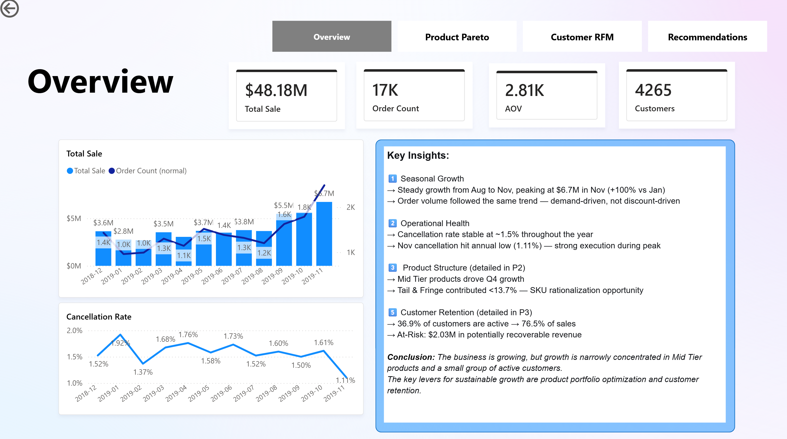
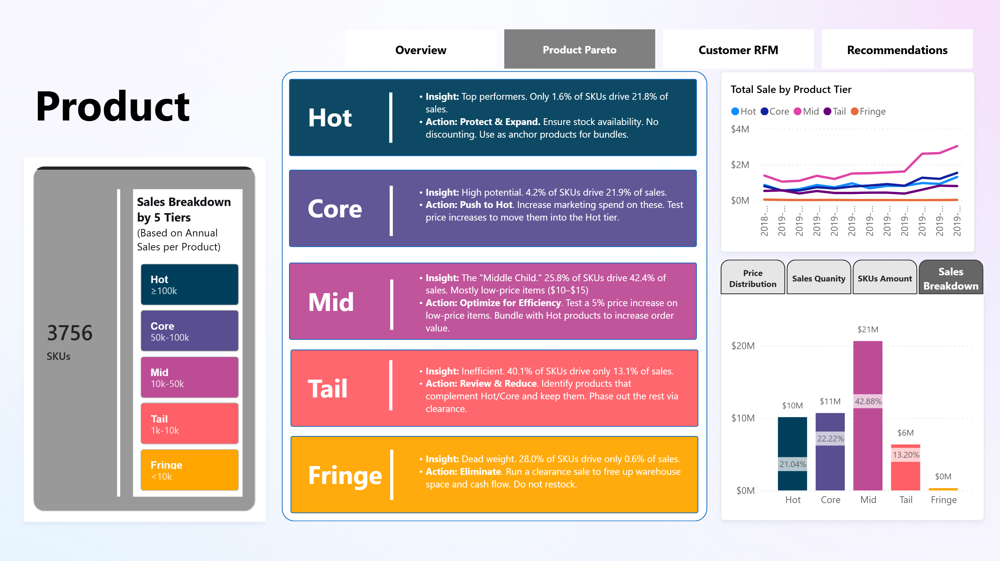
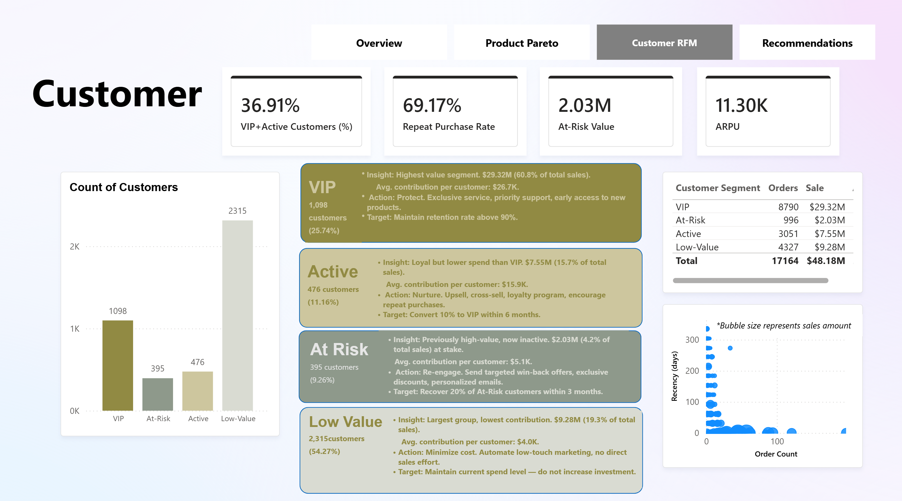
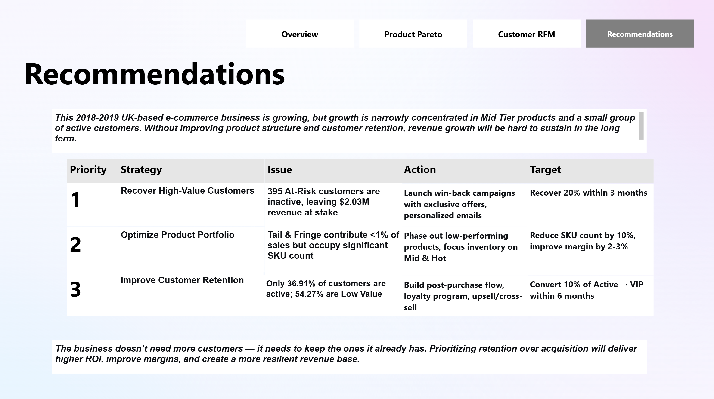

# UK E-Commerce Sales Dashboard (Power BI)

## 📌 Project Overview
This Power BI dashboard analyzes 12 months of sales data for a UK-based e-commerce business. 
The goal was to identify product structure and customer retention issues, and provide actionable recommendations.

**Tools used:** Power BI Desktop, Power Query, DAX

**Key metrics:** $48.18M total sales, 4,284 customers, 17K orders, AOV $2.81K

## 📊 Dashboard Pages

### Page 1: Executive Summary

### Page 2: Product Pareto

### Page 3: Customer RFM

### Page 4: Recommendations

## 🔍 Key Insights
- Mid Tier products drove Q4 growth but contributed only 40% of sales
- VIP + Active customers = 36.7% → 76.5% of sales
- At-Risk customers represent $2.03M in potentially recoverable revenue
- Tail & Fringe products contribute <1% of sales — SKU rationalization opportunity

## 💡 Recommendations
1. **Recover High-Value Customers** — Win-back campaigns for 395 At-Risk customers
2. **Optimize Product Portfolio** — Phase out Tail & Fringe products
3. **Improve Customer Retention** — Build post-purchase flow to convert Active → VIP

## 📂 Files
- `Ecommerce_Dashboard.pbix` — Power BI file
- `/Images` — 4 dashboard screenshots
